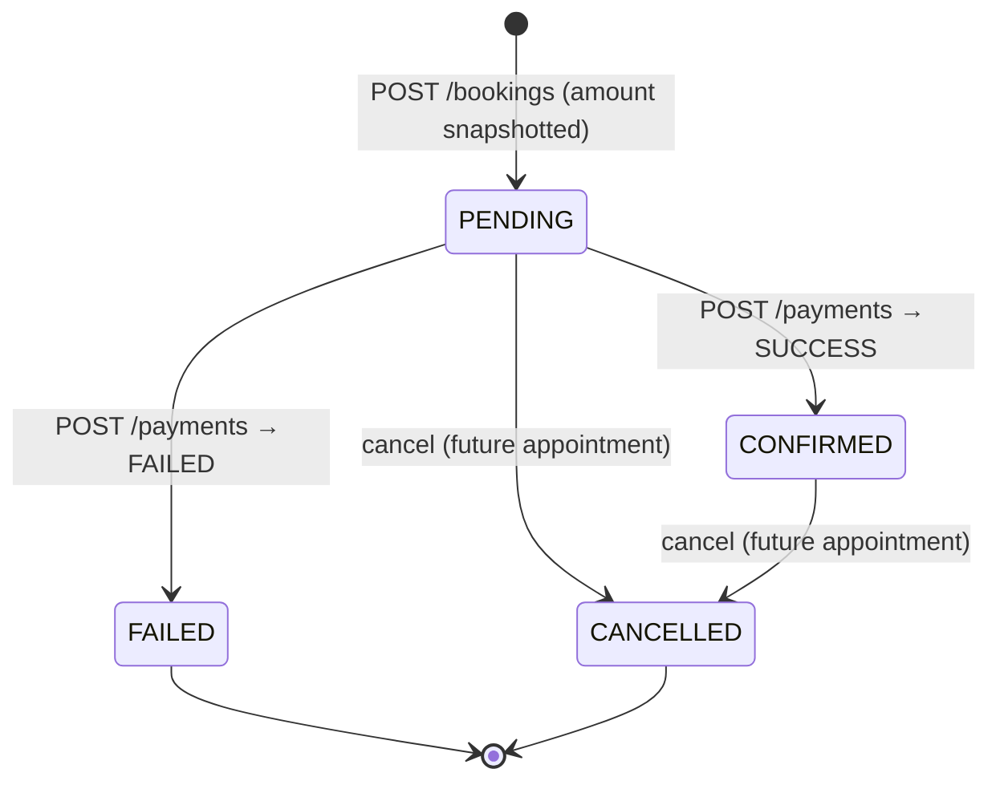
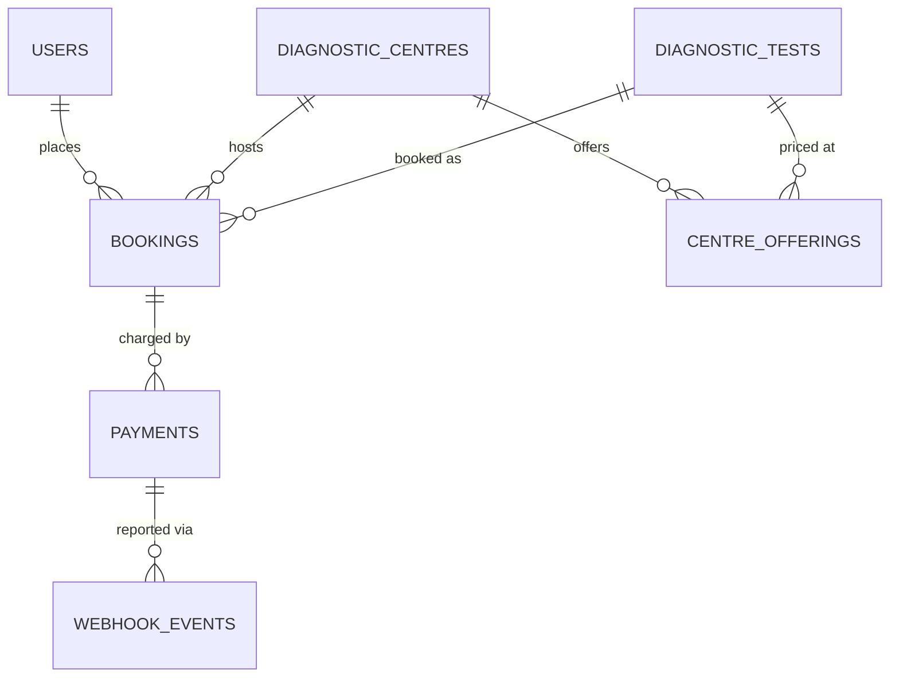

# EVE Healthcare — Diagnostic Bookings & Simulated Payments API

> A production-minded FastAPI backend for **diagnostic test bookings** with a **simulated payment gateway** and an **exactly-once payment webhook** — built for the EVE Healthcare SDE Intern backend assignment.

[](https://github.com/darshhannnn/eve-healthcare-booking-api/actions/workflows/ci.yml)


## Why this repo is worth a read

- **Clean API design** — 22 documented endpoints with a uniform error contract, a shared pagination envelope, and Swagger/OpenAPI at [`/docs`](#quick-start) with one-click auth.
- **Correct data modelling** — priced centre↔test offerings instead of duplicated rows, amount *snapshotted* at booking time, money as `NUMERIC(10,2)` and JSON strings (never floats), timezone-aware UTC timestamps everywhere.
- **Idempotency done properly** — every webhook delivery is recorded in an event ledger keyed by the provider's `event_id`; duplicates, conflicting and late events are handled explicitly, with a unique-constraint backstop for concurrent deliveries.
- **Edge cases first** — 40+ failure paths mapped to specific status codes ([full table](#edge-cases-handled)).
- **Tested** — 68 tests running in **GitHub Actions CI** on Python 3.11–3.13, with an isolated in-memory database per test.
- **Ops-ready extras** — Docker & docker-compose with healthchecks, JSON structured logging, rate limiting, a Redis-ready TTL cache, and admin tooling for webhook retries.

## Contents

- [Quick start](#quick-start)
- [Seeded data & credentials](#seeded-data--credentials)
- [API reference](#api-reference)
- [End-to-end walkthrough (curl)](#end-to-end-walkthrough-curl)
- [State machines](#state-machines)
- [Database design](#database-design)
- [Webhook design & idempotency](#webhook-design--idempotency)
- [Edge cases handled](#edge-cases-handled)
- [Bonus engineering included](#bonus-engineering-included)
- [Configuration](#configuration)
- [Tests](#tests)
- [Assumptions](#assumptions)
- [What I would improve with more time](#what-i-would-improve-with-more-time)
- [Project structure](#project-structure)
- [License](#license)

---

## Quick start

### Option A — Docker (PostgreSQL, recommended)

```bash
docker compose up --build
# API      -> http://localhost:8000
# Swagger  -> http://localhost:8000/docs
```

Compose starts PostgreSQL 16 + the API, creates the schema on startup, and seeds demo data (see below).

### Option B — Local Python (SQLite, no external services)

```bash
python -m venv .venv
source .venv/bin/activate            # Windows: .venv\Scripts\activate
pip install -r requirements.txt
cp .env.example .env                 # optional; defaults work out of the box
uvicorn app.main:app --reload
```

### Verify everything works

```bash
pytest                          # 68 tests
python scripts/smoke.py         # 16-check happy path against a running server
```

---

## Seeded data & credentials

| What | Value | Notes |
|---|---|---|
| Admin user | `admin@example.com` / `Admin@12345` | Created at startup if missing; **change via env in production** |
| Demo patient | `demo@example.com` / `Demo@12345` | Only when `SEED_DEMO_DATA=true` (docker-compose sets it) |
| Demo catalogue | 3 centres, 7 tests, 14 priced offerings | e.g. *EVE Diagnostics — Indiranagar* offers CBC at ₹299 |

You can also seed manually against the configured database: `python -m app.seed`.

---

## API reference

Interactive docs: **`/docs`** (Swagger UI) and **`/redoc`**. All responses are JSON; amounts are strings (`"499.00"`); timestamps are ISO-8601 UTC.

| Method | Path | Auth | Description |
|---|---|---|---|
| POST | `/auth/signup` | — | Register (`email`, `password`, `full_name`) → `201` |
| POST | `/auth/login` | — | JWT login. Accepts **JSON** `{email, password}` **or** the OAuth2 form (`username`/`password`) used by Swagger's Authorize button |
| GET | `/auth/me` | Bearer | Current user profile |
| GET | `/centres` | — | List centres. `?page`, `?page_size`, `?search=` (name/location) |
| POST | `/centres` | Admin | Create a centre |
| GET | `/centres/{id}` | — | Centre detail incl. offerings with prices |
| PATCH | `/centres/{id}` | Admin | Update name/location |
| POST | `/centres/{id}/offerings` | Admin | Offer a test at a centre `{test_id, price}` |
| PATCH | `/centres/{id}/offerings/{test_id}` | Admin | Update price |
| DELETE | `/centres/{id}/offerings/{test_id}` | Admin | Remove offering → `204` |
| GET | `/tests` | — | Global test catalogue. `?page`, `?page_size`, `?search=` |
| POST | `/tests` | Admin | Add a test to the catalogue |
| POST | `/bookings` | Bearer | Book a test `{centre_id, test_id, appointment_at}` → `201` |
| GET | `/bookings` | Bearer | Own bookings (admins: all). `?status=PENDING…`, `?page` |
| GET | `/bookings/{id}` | Bearer | Booking detail (owner or admin) |
| POST | `/bookings/{id}/cancel` | Bearer | Cancel (owner or admin) |
| POST | `/payments` | Bearer | Pay a PENDING booking `{booking_id, simulate_outcome?}`; optional `Idempotency-Key` header |
| GET | `/payments` | Bearer | Own payments (admins: all). `?booking_id=` |
| GET | `/payments/{id}` | Bearer | Payment detail (owner or admin) |
| POST | `/payments/webhook` | HMAC | Provider status updates — **idempotent** (see below) |
| GET | `/admin/webhook-events` | Admin | Inspect webhook deliveries (`?status=`) |
| POST | `/admin/webhook-events/{id}/retry` | Admin | Reprocess a stored event |
| GET | `/health` | — | Liveness probe |

> Paths are canonical without a trailing slash (`/payments`); a request to `/payments/` is answered with a `307` redirect that preserves the method.

### Example payloads

```jsonc
// POST /bookings
{"centre_id": 1, "test_id": 1, "appointment_at": "2026-10-05T09:30:00Z"}

// POST /payments  (simulate_outcome: "success" (default) | "failure")
{"booking_id": 1, "simulate_outcome": "success"}

// POST /payments/webhook   (headers: X-EVE-Signature: hex hmac-sha256 of the raw body)
{"event_id": "evt_2c9a8f41", "payment_reference": "pay_9f2c41aa", "status": "SUCCESS"}
```

---

## End-to-end walkthrough (curl)

```bash
BASE=http://localhost:8000

# 1) Sign up + log in as a patient
curl -s -X POST $BASE/auth/signup -H 'Content-Type: application/json' \
  -d '{"email":"riya@example.com","password":"Str0ngPass!23","full_name":"Riya Sharma"}'
TOKEN=$(curl -s -X POST $BASE/auth/login -H 'Content-Type: application/json' \
  -d '{"email":"riya@example.com","password":"Str0ngPass!23"}' | python -c "import sys,json;print(json.load(sys.stdin)['access_token'])")

# 2) Browse centres (public) — demo data is seeded by docker-compose
curl -s "$BASE/centres?search=bengaluru"

# 3) Book a CBC at centre 1
curl -s -X POST $BASE/bookings -H "Authorization: Bearer $TOKEN" -H 'Content-Type: application/json' \
  -d '{"centre_id":1,"test_id":1,"appointment_at":"2026-10-05T09:30:00Z"}'
# -> {"status":"PENDING","amount":"299.00", ...}

# 4) Pay through the mock gateway
curl -s -X POST $BASE/payments -H "Authorization: Bearer $TOKEN" -H 'Content-Type: application/json' \
  -d '{"booking_id":1}' -H 'Idempotency-Key: order-1'
# -> {"status":"SUCCESS","booking_status":"CONFIRMED","provider_reference":"pay_...", ...}

# 5) Simulated provider reports back on the webhook (signed, idempotent)
python - <<'EOF'
import json, hmac, hashlib, httpx
body = json.dumps({"event_id":"evt_demo_1","payment_reference":"pay_PASTE_REF","status":"SUCCESS"}).encode()
sig  = hmac.new(b"whsec_local_dev", body, hashlib.sha256).hexdigest()   # compose default WEBHOOK_SECRET
r = httpx.post("http://localhost:8000/payments/webhook", content=body, headers={"X-EVE-Signature": sig})
print(r.status_code, r.json())
EOF

# 6) Cancel (allowed for future appointments while PENDING/CONFIRMED)
curl -s -X POST $BASE/bookings/1/cancel -H "Authorization: Bearer $TOKEN"
```

---

## State machines



A payment is created with its **final** status (`SUCCESS` or `FAILED`) in the same synchronous call to the mock gateway; webhook events never flip a payment between terminal states.

* The booking's **amount is snapshotted** from the centre's offering price at booking time — later price edits never change existing bookings.
* Only **PENDING** bookings can be paid; a payment on a cancelled/confirmed/failed booking is a `409`.

## Database design



| Table | Key columns | Notes |
|---|---|---|
| `users` | `email` **unique**, `hashed_password` (bcrypt), `role` (USER/ADMIN), `is_active` | |
| `diagnostic_centres` | `name`, `location`, `is_active` | |
| `diagnostic_tests` | `code` **unique** (e.g. `CBC`), `name` | Global catalogue, independent of centres |
| `centre_offerings` | (`centre_id`,`test_id`) **unique**, `price NUMERIC(10,2)` | The same test can be priced differently per centre |
| `bookings` | `user_id`, `centre_id`, `test_id`, `appointment_at` (tz-aware), `amount NUMERIC(10,2)`, `status` | Indexed on `(user_id, status)`; amount snapshotted |
| `payments` | `booking_id`, `amount`, `status`, `provider_reference` **unique**, `idempotency_key` **unique** | One charge = one row; retries reuse the row |
| `webhook_events` | `event_id` **unique**, `payment_id`, `status`, `payload JSON`, `detail` | The idempotency ledger for deliveries |

Design choices worth calling out:

* **Money is `NUMERIC(10,2)`** in the DB and a **string** in JSON — never floats.
* **Many-to-many with price** (`centre_offerings`) instead of duplicating tests per centre, so a test's identity lives in one place while centres own their pricing.
* **All timestamps are timezone-aware UTC**; SQLite (dev) round-trips naive values, so the schema layer normalises every datetime to UTC on the way out.
* Schema is created via `Base.metadata.create_all` at startup — fine for this scope; Alembic migrations are the first thing I'd add (see [improvements](#what-i-would-improve-with-more-time)).

## Webhook design & idempotency

`POST /payments/webhook` consumes events shaped like `{event_id, payment_reference, status}` and is **safe under duplicate delivery** — the property the assignment calls out. Every delivery is recorded in `webhook_events`, keyed by the provider's `event_id`:

| Delivery | Response | State effect |
|---|---|---|
| New event, payment & booking consistent | `200 {"result": "processed"}` | Recorded |
| Same `event_id` again (any number of times) | `200 {"result": "duplicate"}` | **None** — no duplicate payments/bookings |
| Status equals the payment's current status | `200 "processed"` (no-op) | Recorded |
| Conflicting status for an already-terminal payment | `200 "ignored"` | None — *first terminal state wins* (a payment never flips SUCCESS→FAILED) |
| Event for a **cancelled** booking | `200 "ignored"` | None — a cancelled booking is never resurrected |
| Unknown `payment_reference` | `404` | Event stored as `UNMATCHED`, retryable via `POST /admin/webhook-events/{id}/retry` |
| Concurrent duplicate deliveries | one wins, loser hits the `event_id` **unique constraint** → treated as duplicate | No corruption |

**Authenticity:** when `WEBHOOK_SECRET` is set, the raw body must be HMAC-SHA256-signed in the `X-EVE-Signature` header (verified in constant time); mismatch → `401`. Production must set this secret.

**Why "processed/ignored" rather than state changes?** Documented assumption: the mock gateway resolves **synchronously** — `POST /payments` already settles the booking (as the assignment's flow implies). Webhook deliveries therefore model what real providers send after a charge: confirmations, retries and late events. The endpoint's job — and the hard part — is applying them **exactly once** without corrupting booking state, which is what the rules above guarantee. `POST /payments` additionally supports an `Idempotency-Key` header so clients can retry the charge call itself safely.

## Edge cases handled

| Case | Result |
|---|---|
| Invalid email / short password / blank name at signup | `422` with field errors |
| Duplicate signup email (incl. concurrent) | `409` (unique constraint + pre-check) |
| Wrong credentials | `401` with a deliberately vague message |
| Missing/expired/tampered JWT | `401` |
| Non-admin trying to manage centres/tests | `403`; anonymous `401` |
| Booking a test the centre doesn't offer | `422` "not offered at centre" |
| Unknown centre/test/booking/payment | `404` |
| Appointment in the past | `422` |
| Duplicate slot (same user+centre+test+time) | `409` (re-booking after cancellation is allowed) |
| Accessing/cancelling/paying for **someone else's** booking | `403` |
| Paying a non-PENDING (confirmed/failed/cancelled) booking | `409` |
| Cancel a failed/cancelled booking, or one whose appointment passed | `409` |
| Malformed bodies / invalid webhook payloads | `422` |
| Webhook with missing/invalid signature | `401` |
| Repeated webhook events (incl. concurrent) | idempotent no-op, see table above |
| Conflicting/out-of-order webhook statuses | ignored & logged, state never corrupts |
| Webhook referencing an unknown payment | `404`, stored `UNMATCHED`, admin retry endpoint |
| Login/signup flooding | `429` with `Retry-After` (fixed-window, per IP) |
| Naive datetimes in requests | interpreted as UTC (documented) |

## Bonus engineering included

- **Docker & docker-compose** — hardened single-stage Dockerfile (non-root user), compose with healthchecked PostgreSQL and dependency ordering.
- **Swagger/OpenAPI** — full schema-driven docs at `/docs`, including auth wiring for the Authorize button.
- **Unit/integration tests** — 68 tests (auth, RBAC, catalog, bookings, payments, webhook idempotency, rate limiting, pagination) against an isolated in-memory DB per test.
- **Structured logging** — JSON log lines with request id, method, path, status and duration; `X-Request-ID` accepted and propagated.
- **Pagination** — uniform `{items, total, page, page_size, pages}` envelope on every list endpoint.
- **Rate limiting** — fixed-window limiter on auth endpoints (in-memory; swappable for Redis).
- **Caching** — TTL read cache for centre/test listings with write-through invalidation on admin mutations; **Redis backend supported** via `CACHE_BACKEND=redis` and `REDIS_URL`, with graceful fallback when Redis is down.
- **Webhook retry handling** — every delivery is persisted with an outcome (`PROCESSED`/`IGNORED`/`UNMATCHED`); unmatched events are retryable from the admin API.
- **CI** — GitHub Actions runs the full suite with coverage on Python 3.11, 3.12 and 3.13 for every push and pull request.

Celery/background jobs were deliberately left out (no broker dependency in an assignment sandbox) — the natural placement is described in [improvements](#what-i-would-improve-with-more-time).

## Configuration

All settings come from environment variables (or `.env`, see [.env.example](.env.example)):

| Variable | Default | Purpose |
|---|---|---|
| `DATABASE_URL` | `sqlite:///./eve_dev.db` | Any SQLAlchemy URL; compose uses `postgresql+psycopg://…` |
| `JWT_SECRET_KEY` | dev-only value | **Must** be overridden outside local dev |
| `ACCESS_TOKEN_EXPIRE_MINUTES` | `60` | JWT lifetime |
| `WEBHOOK_SECRET` | *(empty = verification off)* | HMAC secret for `/payments/webhook` — set in prod (compose sets `whsec_local_dev`) |
| `ADMIN_EMAIL` / `ADMIN_PASSWORD` | `admin@example.com` / `Admin@12345` | Bootstrap admin |
| `SEED_DEMO_DATA` | `false` | Seed centres/tests/demo patient |
| `RATE_LIMIT_AUTH_PER_MINUTE` | `30` (`0` disables) | Auth endpoints, per IP |
| `CACHE_BACKEND` / `REDIS_URL` | `memory` / — | `redis` enables the Redis cache backend |
| `DEFAULT_PAGE_SIZE` / `MAX_PAGE_SIZE` | `20` / `100` | Pagination bounds |

## Tests

```bash
pytest                 # full suite (68 tests)
pytest --cov=app       # with coverage
pytest tests/test_webhooks.py -v   # just the idempotency suite
```

The same suite runs in **GitHub Actions** (badge at the top) on Python 3.11–3.13 for every push. Each test gets a fresh in-memory SQLite database (shared connection pool so the app and assertions see the same data); the suite runs without PostgreSQL or Docker. The same business logic runs against PostgreSQL in docker-compose.

## Assumptions

1. **Mock gateway is synchronous.** `POST /payments` returns the final `SUCCESS`/`FAILED` and updates the booking, per the assignment's flow. The webhook exists for provider-driven deliveries (retries/late events) and is where duplicate-delivery safety is enforced.
2. **`simulate_outcome` stands in for card behaviour** (`"success"` default, `"failure"` to force a decline). No card data is accepted or stored.
3. **First terminal state wins.** A payment never transitions between SUCCESS and FAILED; conflicting webhook events are recorded and ignored.
4. **Cancellation** is allowed for PENDING/CONFIRMED bookings with a **future** appointment; refunds are out of scope (noted as an improvement).
5. **Centre/test management is admin-only**; reading the catalogue is public. Admin is bootstrapped from env at startup.
6. **Booking authorization** returns `403` (not 404) for another user's booking — explicit and testable; listing is always owner-scoped.
7. **Duplicate slot rule:** same user + centre + test + exact appointment time. Re-booking after cancellation is allowed. (A partial unique index would enforce this at the DB level on PostgreSQL — see improvements.)
8. **Naive timestamps are UTC.** Clients are encouraged to send explicit offsets.
9. **Amounts are snapshot-priced** at booking time; later price changes don't affect existing bookings.
10. **SQLite is a dev/test convenience**; PostgreSQL is the intended production database (psycopg 3 driver).

## What I would improve with more time

1. **Alembic migrations** instead of `create_all`, plus CI running the suite against a real PostgreSQL service container.
2. **Async payment flow with Celery + Redis:** `POST /payments` would enqueue a `process_payment` task (broker = Redis), return `PENDING`, and the worker would settle the booking and emit the webhook — making the webhook the primary settlement path, with exponential-backoff retries for transient failures.
3. **Provider abstraction:** an interface the mock implements, so a real gateway (Stripe/Razorpay) can be added without touching booking logic; signatures verified via the same webhook path.
4. **Refresh tokens & revocation** (jti denylist), email verification, password reset.
5. **PostgreSQL partial unique index** (`WHERE status <> 'CANCELLED'`) to enforce the duplicate-slot rule at the DB level under concurrency.
6. **Redis-backed rate limiting and distributed locks** (`SELECT … FOR UPDATE` is already used for payment transitions) for multi-worker deployments.
7. **Observability:** Prometheus metrics, trace ids propagated to logs, Sentry.
8. **Tooling & hardening:** ruff/mypy in CI, pre-commit, gunicorn+uvicorn workers, per-endpoint OpenAPI examples, a Postman collection.

## Project structure

```
app/
├── main.py                  # app factory, lifespan (create_all + seeding), logging middleware
├── seed.py                  # idempotent admin + demo seeding (python -m app.seed)
├── core/                    # config, security (JWT/bcrypt/HMAC), errors, JSON logging, time utils
├── db/                      # declarative base, engine/session providers
├── models/                  # SQLAlchemy models: user, catalog, booking, payment
├── schemas/                 # Pydantic request/response contracts (Page[T], money as str)
├── services/                # business logic: booking_service, payment_service
└── api/
    ├── deps.py              # get_current_user, require_admin, pagination
    ├── router.py            # router aggregation
    └── routes/              # auth, catalog, bookings, payments, admin
tests/                       # 68 pytest tests, in-memory DB per test
scripts/smoke.py             # end-to-end happy-path check against a live server
Dockerfile · docker-compose.yml · requirements.txt · pyproject.toml · .env.example
```

---

## License

MIT — see [LICENSE](LICENSE).

---

Good luck reviewing — happy to walk through any design decision!
